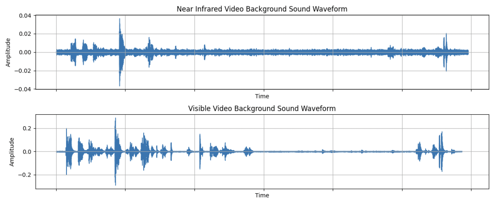
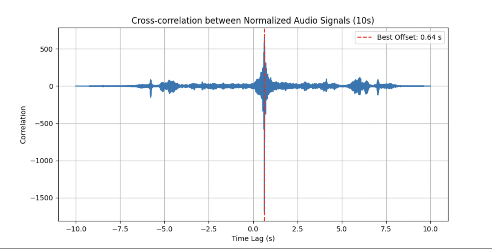
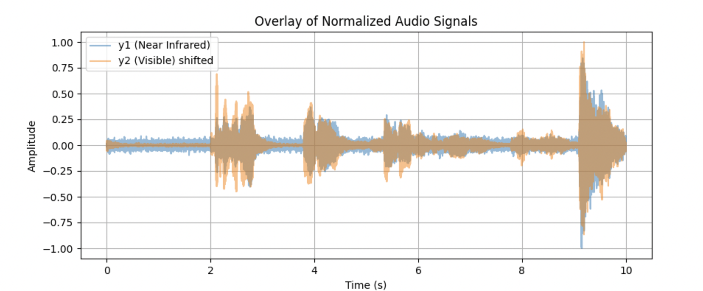
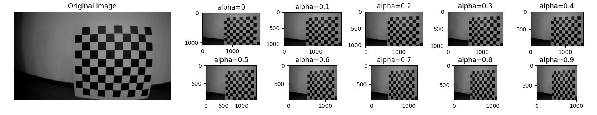
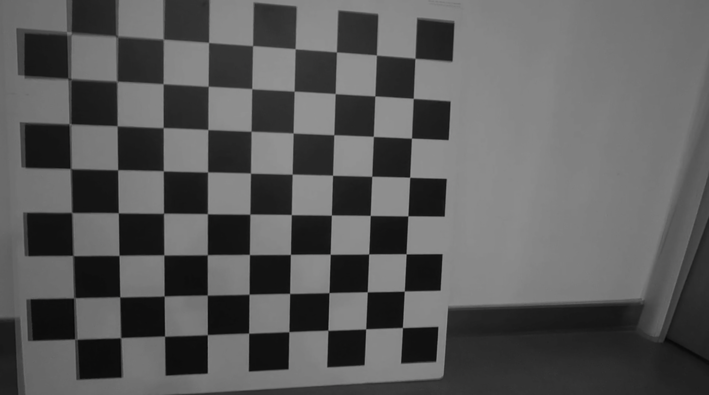

# Calibration.Alignment_with_Synchro


**任务进度**

- [x] 视频同步 `注` <u>方法待验证</u>
- [x] 畸变校正 
- [x] ~~VIS$\rightarrow$IR 单应矩阵  `注` <u>待验证</u>~~
- [ ] ~~可见光到近红外的透视变换 `注` <u>效果不佳</u>~~

```bash
./Launch_from_Scratch.sh
```

> 将 ***VIS.mp4*** 和 ***IR.mp4*** 文件放入 ***./calibration_data/videos*** 目录下后可选择分开运行或者 .sh 文件运行

------


## STEP.0：同步近红外与可见光视频（数据预处理）

**存在问题**：近红外视频与可见光视频的录制过程缺乏同步



**解决方案**：计算背景声音的 correlation 得到可见光视频同步到近红外视频的最佳 offset





## STEP.1：将视频剪切成 jpg 格式图片并保存

## STEP.2：计算相机内参和畸变系数

**相机内参**：
$$
\begin{bmatrix}
fx & 0  & cx \\
0  & fy & cy \\
0  & 0  & 1
\end{bmatrix}
$$

> `fx` 和 `fy` 是相机在 x 和 y 方向的焦距（以像素为单位）。
>
> `cx` 和 `cy` 是主点（通常是图像的中心点）的坐标。

**畸变系数**：
$$
[k1, k2, p1, p2, k3]
$$

> `k1` 和 `k2` 是径向畸变系数。
>
> `p1` 和 `p2` 是切向畸变系数。
>
> `k3` 是径向畸变的更高阶系数。

## STEP.3：校正指定文件夹中的图像

**$\alpha$ (Alpha) ：**自由缩放参数。如果它是-1或缺省，则该函数将执行默认缩放。否则，该参数应在0到1之间。alpha = 0表示对校正的图像已经经过缩放和移动了，以便仅有效像素可见（在校正之后的非黑色区域）。 alpha = 1表示对校正后的图像进行抽取和移位，以便将来自摄像机的原始图像中的所有像素保留在校正后的图像中（不丢失任何源图像像素）。任何中间值（0～1）都会在这两种极端情况之间产生中间结果。



## STEP.4：~~校正后计算可见光到近红外的单应矩阵~~

## STEP.5：~~利用单应矩阵计算可见光图像的透视变换~~

